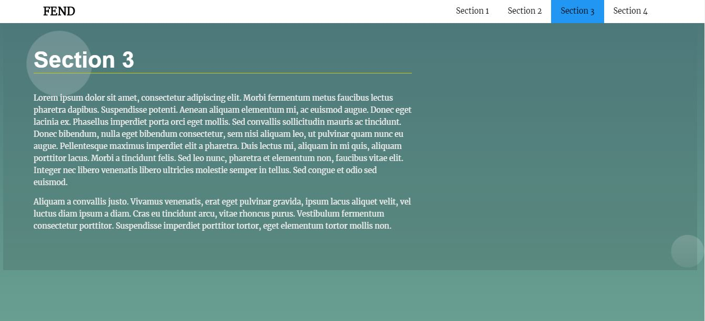

# Landing-Page

## About the Project
The aim of the project is to work on a real-world scenario of manipulating the DOM. Besides diplaying how javascript can improve 
the usability of an otherwise static site the objective here is to append dynamically added data to the DOM. 

#### ***This project uses JavaScipt in a way that allows us to modify the DOM, and thus the website without editing the HTML of the page.***

## Component Build
To understand the virtual DOM we dynamically build the navigation menu for a multi-section landing page. 
To improve the user experience, the section actively being viewed is highlighted on the navbar menu. Additionally, when a user 
clicks on a navigation item, the item scrolls smoothly to the appropriate section rather than the default jump.

## Main Features
* Build the navigation menu dynamically using JavaScript
* Add functionality to distinguish the section in view
* Add the functionality to scroll to sections

### Learning component
The landing page presents the opportunity to combine skills in HTML, CSS, and JavaScript into a large project.
